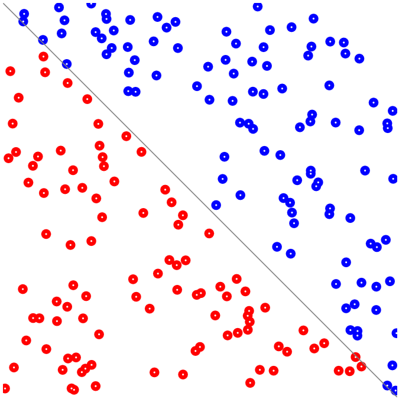

# A Neural Network from scratch in JavaScript

## Quickstart

1. Download [master.zip][1]
1. Extract the zip
1. Open the `neural-network-js-master` directory
1. Open `index.html`

That should open in a browser with a page that looks like the above screenshot.

Then follow the [tutorial][2].

[1]: https://github.com/ianchanning/neural-network-js/archive/master.zip
[2]: tutorial/README.md
