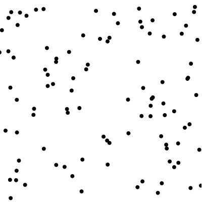

# A Neural Network (Perceptron) from scratch in JavaScript

[](neural-network-screenshot.png)

## The plan

We're going to train a single neuron (perceptron) to linearly separate some 2D points.

All done in pure JavaScript, from scratch with no libraries

## Quickstart

1. Download [master.zip][14]
1. Extract the zip
1. Open the `neural-network-js-master` directory
1. Open `index.html`

That should open in a browser with a page that looks like the above screenshot

# Tutorial

My background (biases)

Maths and Computer Science at Imperial in London

JavaScript / React for imec

All AI knowledge from online courses (In Andrew Ng we trust)

# The plan

> Implementing it myself from scratch was the most important
>
> — Andrej Karpathy talking to Andrew Ng (2018) [[2][2]]

1. Generate data
1. Visualize it
1. Label it
1. Train a perceptron to classify it

# Inspired / blatantly copied from

Funfunfunction neural network YouTube playlist [[3][3]]

*... but it's missing maths*

deeplearning.ai week 2 [[4][4]]

*... but code isn't open, filling in blanks*

Neural Networks & Deep Learning course [[5][5]]

*... but no code*

# Get ourselves setup

Install VS Code (optional) <https://code.visualstudio.com>

Download & extract the zip <https://github.com/ianchanning/neural-network-js>

Run `npm install` (optional for Node.js geeks)

Open `index.html`

Open Browser tools (F12)

# Slight digression (humour me)

Code <3 Maths

JavaScript's `map` functions in maths

Reduce the gap between maths and code

# Let's draw a graph

$y = f(x) = 2x$

      y
      ^
      |
    4 |   +
    3 |
    2 | +
    1 |
    0 +------> x
      0 1 2

# Map my function up

Change each item in list to get another list

In maths this is called Mapping

     xs "exes"          ys "whys"
    +-------+          +-------+
    | 0 1 2 | -- f --> | 0 2 4 |
    +-------+          +-------+

`f` _maps_ the 'set' `0,1,2` _on to_ `0,2,4`

# $f(x)$ in JavaScript

$y = f(x) = 2x$

```javascript
function f(x) {
  return 2 * x;
}
var xs = [0, 1, 2];
var ys = xs.map(f); // [0,2,4]
```

`map` is awesome. Kill all loops!


# Start the coding

Create a new file `tutorial.js` then add a `nn` function:

```javascript
function nn() {
  // all your var are belong to us
}
nn(); // call our function immediately
```
Note: Wrap code inside a function to avoid evil global scope [[9][9]]

Edit `index.html` and change the script `src`:

```diff
-<script src="neural-network.js"></script>
<script src="tutorial.js"></script>
```

# Skeleton

The outline of what we're going to produce, add this *inside* the `nn` function:

```javascript
// data
function generator() {
}

// SVG chart elements
function chart() {
}

// perceptron / neuron
function neuron() {
}

// generator + neuron + chart
function build() {
}

// draw the chart to root `<div>`
function draw() {
}
return draw();
```

# Display random values

Generate random test and training sets

Add this inside `generator()` (yes functions, in functions in functions is fine ;)):

```javascript
function rand(min, max) {
  return Math.random() * (max - min) + min;
}
// examples
// rand(1, 3);
// rand(0, 400); // x1 & x2 range
```

# What's the point?

Our graph will be made up of `[x1, x2]` points

Example: one random point in JavaScript (don't need to add this to the code):

```javascript
var point = [rand(0, 400), rand(0, 400)];
```

# Generate a set of random test values

Perhaps I should use a for loop? (never!)

Map all the things!

Generate an empty array and use that to generate our new set

Add this inside `generator()` at the end:

```javascript
function points(length) {
  return Array(length)
    .fill(0)
    .map(function() {
      return [rand(0, 400), rand(0, 400)];
    });
}
return { points };
```

Mapping `[0,...] ---> [[x1,x2],...]`

# Display these test values

Gonna need a graph mate, how does that SVG work again?

Should've read CSS-Trick's excellent guide on SVG Charts [[10][10]]

(optional) You can add this to `index.html` if you want to see a single point being displayed

```xml
<svg
  version="1.1"
  xmlns="http://www.w3.org/2000/svg"
  height="400"
  width="400"
>
  <circle cx="90" cy="192" r="4"></circle>
</svg>
```

**Brain shift required: `(0,0)` is top left**

# Putting SVG in JavaScript

Modify `chart()` to add two new parameters:

```diff
-function chart() {
function chart(height, width) {
```

Add this inside `chart()`:

```javascript
// <name xmlns="..."></name>
function element(name, attrs) {
  var ns = "http://www.w3.org/2000/svg";
  var elem = document.createElementNS(ns, name);
  Object.keys(attrs).map(function(key) {
    elem.setAttribute(key, attrs[key]);
  });
  return elem;
}

// <svg ...></svg>
function svg() {
  return element("svg", { height, width });
}
```

# Draw the circle

Add this inside `chart()` at the end:

```javascript
// centre is a point [x1,x2]
// <circle cx="0" cy="0" r="4" fill="blue"></circle>
function circle(centre, r, fill) {
  var [cx, cy] = centre;
  return element("circle", { cx, cy, r, fill });
}
return { svg, circle };
```

# Draw the test values as circles on a graph

Modify `build()` to add two new parameters:

```diff
-function build() {
function build(generator, chart) {
```

I want to `map` my test values onto the graph, add this inside `build()`:

```javascript
var svg = chart.svg();
generator.points(100).map(function(point) {
  svg.appendChild(chart.circle(point, 4, "black"));
});
return { svg };
```

Add this to `draw()`:

```javascript
var myGenerator = generator();
var myChart = chart(400, 400);
var myBuild = build(myGenerator, myChart);
document.getElementById("root").appendChild(myBuild.svg);
```

# Visualise our data

Now if you save `tutorial.js` and refresh `index.html` we should have a visualization of our data, something like this:

[](data-screenshot.png)

As you refresh the page the location of the dots should change at random

# Colour the circles red or blue

In `build()`, rather than black circles we can draw random red or blue circles

```diff
-generator.points(100).map(function(point) {
-  svg.appendChild(chart.circle(point, 4, "black"));
-});
var colours = ["red", "blue"];
generator.points(100).map(function(point) {
  var team = Math.round(Math.random());
  svg.appendChild(chart.circle(point, 4, colours[team]));
});
```

# Separate these circles with a line

Time to racially discriminate our happy circles ...err "linearly separate" them

We need a wall!

Add this to `chart()`:

```javascript
// start, end are points [x1,x2]
// <line x1="0" y1="0" x2="1" y2="1" stroke="red"></line>
function line(start, end, stroke) {
  var [x1, y1] = start;
  var [x2, y2] = end;
  return element("line", { x1, y1, x2, y2, stroke });
}
return { svg, circle, line };
```

# Build the wall! Build the wall!

Add this to `build()` before the `return`:

```javascript
svg.appendChild(chart.line([0, 0], [400, 400], "black"));
```

# Make the colour depend on which side of the line

One side are the blues, and the other side are the reds. Go blues!

Now as the mighty dictator we know how to label them. Reminder: SVG coordinates have (0,0) in the top left

In our `generator()`:

```javascript
// which side of the wall
function team(point) {
  return point[0] > point[1] ? 1 : 0;
}
return { points, team };
```

and in `build()` set the team dynamically:

```javascript
var team = generator.team(point);
```

# Label my random examples

Get our own slave labour / Amazon Mechanical Turk [[11][11]] to label data for us

```javascript
var example = {
  point: [0, 1],
  actual: ???
};
```

# Say whether my examples are red or blue

In `generator()`:

```javascript
// points is a set of [x1,x2] points
function labeller(points) {
  return points.map(function(point) {
    return {
      point: point,
      actual: team(point)
    };
  });
}

// labelled training data
function examples(length) {
  return labeller(points(length));
}
return { points, team, examples };
```

# Make a guess based on x1, x2 whether a circle is red or blue

Time for the good stuff

**Don't confuse x, y with x1, x2**

# Perceptron or neuron?

Originally called a perceptron [[6][6]]

Changed to a neuron with the sigmoid activation function - (there's probably a better definition)

Mathematical concepts different, but coding concepts similar

For us:

1. Focus on the perceptron
2. Discuss all elements leading to gradient descent

# Combine my inputs into one value

Combine inputs into one value

More important inputs have a bigger impact

Pathways in the brain become stronger the more they are used (see Inner Game of Tennis)

Weighted sum / dot product (1 row x 1 column)

# Multiply 1 row matrix x 1 column matrix

Total the inputs using vector dot product / weighted sum

    w . x = [w1 w2]|x1|
                   |x2|

A vector in Python is a list, in JavaScript an array

Add this to `neuron()`:

```javascript
// 2-D dot product only, [w1,w2], [x1,x2]
function dot(w, x) {
  return w[0] * x[0] + w[1] * x[1];
}
```

We can scale the dot product to as many elements as we want

# Describe a perceptron firing

Perceptron 'fires' when inputs reach a threshold

                 | 0 if w . x <= threshold
    activation = |
                 | 1 if w . x > threshold

Subtract threshold from both sides and call it 'bias'

    bias = -threshold

                 | 0 if w . x + bias <= 0
    activation = |
                 | 1 if w . x + bias > 0

# Activation graph

![step (Neural Networks and Deep Learning [[13][13]])](tutorial/step.png)

# Activation code

N.B. Our 'wall' goes through zero so we don't need bias

Add this to `neuron()`:

```javascript
// z = dot(w, x) + bias
// a = g(z)
function activation(z) {
  return z <= 0 ? 0 : 1;
}
```

Easiest function you can write &rarr; basis for all neural networks?

Someone is having a laugh / it's genius $E = mc^2$

# A neural network of one neuron

> An Englishman, even if he is alone, forms an orderly queue of one
>
> — George Mikes

Neurons act independently so can scale up process to a network

          w1  +--------------------------+
     x1 ------|               |          |
          w2  | z = w . x + b | a = g(z) |----> ~y
     x2 ------|               |          |
              +--------------------------+

`w . x` is the dot product / weighted sum

`b` is the bias

`g` is our 'activation' function

`a` / `~y` is our approx/guess of `y`, usually called `ŷ` 'y hat'

# Start somewhere

Initialise our weights to either 0 or small random values

Add `weights` to `generator()` and return

```javascript
// experiment with (0,0) or rand(0,400), or rand(0,1)
var weights = [rand(-1, 1), rand(-1, 1)];

return { points, team, examples, weights };
```

# Make a first guess

Make a prediction from our weights

In `neuron()`:

```javascript
// a = g(w . x + b)
function prediction(w, x) {
  return activation(dot(w, x));
}
return { prediction };
```

# Display my predictions

Instead of our known `team` use our `prediction`

In `build()` replace:

```javascript
// var team = generator.team(point);
var team = neuron.prediction(generator.weights, point);
```

Add `neuron` to `build()`:

```javascript
function build(generator, chart, neuron) {
  // ...
}
```

Create & pass neuron in `draw()`:

```javascript
var myNeuron = neuron();
var myBuild = build(myGenerator, myChart, myNeuron);
```

# Get a better feel for what the weights mean

Change the initial `weights` to some random values and show the weights we're using

In `draw()` add this at the end:

```javascript
drawP("intial w: " + myGenerator.weights.join());
```

Which weights give the best predictions?

# Adjust the weights to improve my guess

Feed the difference back into the weights

Add these to `neuron()`:

```javascript
function diff(y, a) {
  return y - a;
}

function adjust(w_i, x_i, ydiff) {
  return w_i + ydiff * x_i;
}
```

# Combine these into a training step

One small step for one example

<https://en.wikipedia.org/wiki/Perceptron#Steps>

Add this to `neuron()`:

```javascript
// step 1: initialise weights w
// step 2: for each example x with actual y
function step(w, x, y) {
  // step 2a: calculation actual output
  var a = prediction(w, x);
  // step 2b: update the weights for each x[i]
  var ydiff = diff(y, a);
  return [adjust(w[0], x[0], ydiff), adjust(w[1], x[1], ydiff)];
}
return { prediction, step };
```

# Do a single step of training

We can look at how the weights change step by step but I think it's overkill

Apply it in `build()`

```javascript
var example = generator.examples(1);
var weights = neuron.step(
  generator.weights, // w
  example[0].point, // x
  example[0].actual // y
);
generator.points(100).map(function(point) {
  var team = neuron.prediction(weights, point);
});
```

# One last digression

More maths in JavaScript

The `reduce` function

# The sum of 2 times x, with x going from 1 to 3

$y = {\sum} f(x) = {\sum} 2x$

     x  2x y
     1  2  2
     2  4  6
    +3 +6  12
    -- --
     6 12

```javascript
// same f(x) from before
function f(x) {
  return 2 * x;
}
function sum(y, x) {
  return y + f(x);
}
var xs = [1, 2, 3];
// sum the f(x)s starting from 0
var y = xs.reduce(sum, 0); // y = 12
```

This is less obvious than the `map` example

Still `sum` is just a function and `f(x)` is just a function

We can change `sum` to `multiply` and we keep the mathematical concepts

If we write this with loops we are changing the thought patterns

# Train using all examples

`reduce` the examples down into a single set of trained weights

Add this to `neuron()` and include it in the return value

```javascript
// intial weights w
// labelled examples
function train(w, examples) {
  // wrapper function to work with reduce
  function trainExample(w, example) {
    return step(w, example.point, example.actual);
  }
  // repeatedly updates w and returns the trained w
  return examples.reduce(trainExample, w);
}
return { prediction, step, train };
```

# Replace the guess with trained weights

In `build()` replace single step with:

```javascript
var weights = neuron.train(
  generator.weights,
  generator.examples(400) // how many?
);
```

Have we gotten any better at guessing?

We can expand the count of examples and get a pretty perfect answer

# See what the trained weights are

Draw another paragraph and put it in a function as we're repeating the steps

Return the trained weights from `build()`:

```javascript
return { svg, weights };
```

Then in `draw()` add:

```javascript
drawP("trained w: " + myBuild.weights.join());
```

# Re-use the examples

Used all the examples, but only once. Like revising with looking at your notes just once

So it's a good idea to re-use them but... **bias**

Box with no senses + same examples over and over again

&rarr; start noticing things that aren't relevant

# A metric for how well the weights worked

First consider how well an individual example worked

# A metric for how far a prediction is from the actual

Compare the Euclidean distance [[12][12]] between actual and predicted

`y` and `a` are both numbers on the number line, so we compare a one-dimensional distance - the absolute difference

           +--+
    -2 -1  0  1  2  3  4

Add this in `neuron()`:

```javascript
// sqrt((y - a) ** 2) = abs(y - a)
function loss(w, example) {
  var predict = prediction(w, example.point);
  return Math.abs(example.actual - predict);
}
```

# Average the metric across all examples

$$
\frac{1}{m} \sum_j^m \lvert y_j - g(z_j) \rvert
$$

Sum using the `reduce` function and then divide by the length

Add this in `neuron()`:

```javascript
// the average of all loss functions
function cost(w, examples) {
  function sum(total, example) {
    // console.log({w, loss: loss(w, example)});
    return total + loss(w, example);
  }
  return (1 / examples.length) * examples.reduce(sum, 0);
}
```

# Minimise this metric until it's good enough

Our `train` did one iteration through the examples

Now repeatedly iterate through until we reach a threshold

```javascript
// threshold when cost is low enough
// how many iterations (epochs)
function gradDescent(w, examples, threshold, epochs) {
  var c = cost(w, examples);
  if (epochs < 0 || c < threshold) {
    return w;
  }
  var wt = train(w, examples);
  return gradDescent(wt, examples, threshold, epochs - 1);
}
return { prediction, step, train, gradDescent };
```

N.B. recursion - alternative to a `while` loop

# Build it and give this process a name

In `build()`, replace the `weights` with:

```javascript
var weights = neuron.gradDescent(
  generator.weights,
  generator.examples(400),
  0.0001, // threshold
  100 // epochs
);
```

Once we have a function we can differentiate, this is called Gradient Descent

We can't differentiate the activation function, but once we use the sigmoid function the differentiated variables become almost exactly the same

For perceptrons this is just called an iteration

Add some logging to the `gradDescent` function to see progress

# In summary

Generated random set of training and test data that we displayed on a graph for testing

Split the points on the graph using an abritrary line (why? back propagation needs linear separation)

Used a perceptron with an activation function and 'back propagation' algorithm

Trained this perceptron to adjust two weights

Improved this by applying multiple steps of 'gradient descent'

**THE END (almost)**

# Perceptron (not differentiable)

![step (Neural Networks and Deep Learning [[13][13]])](tutorial/step.png)

# Sigmoid neuron (differentiable)

![sigmoid (Neural Networks and Deep Learning [[13][13]])](tutorial/sigmoid.png)

# Sigmoid in code

A new activation and new loss function

More complex, but they're still functions

$g(z) = 1 / (1 + e^{-z})$

```javascript
function activation(z) {
  return 1 / (1 + Math.exp(-z));
}
```

$L = -(y {\log a} + (1 - y) {\log (1 - a))}$

```javascript
function loss(y, a) {
  return -(y * Math.log(a) + (1 - y) * Math.log(1 - a));
}
```

# Gradient descent for sigmoid

As per Andrew Ng / deeplearning.ai week 2 [[4][4]]

Potential for a workshop - implement the following code

```javascript
var J,
  dw1,
  dw2,
  db = 0;
for (var i = 0; i < m; i++) {
  var x_i = examples[i].point;
  var y_i = examples[i].actual;
  var z_i = dot(w, x_i) + b;
  var a_i = activation(z_i);
  J += loss(y_i, a_i);
  var dz_i = a_i - y_i; // diff function
  dw1 += x_i[0] * dz_i; // adjust function
  dw2 += x_i[1] * dz_i;
  db += dz_i;
}
```

# Gradient descent part 2

```javascript
J /= m;
dw1 /= m;
dw2 /= m;
db /= m; // averages
w1 = w1 - alpha * dw1; // learning rate alpha
w2 = w2 - alpha * dw2;
b = b - alpha * db;
```

# The end

> What I cannot create, I do not understand.
>
> — Richard Feynman(1988) [[8][8]]

...

> Young man, in mathematics you don't understand things. You just get used to them.
>
> — John Von Neumann

...

> What you really want is to feel every element (and the connections between them) in your bones.
>
> — Michael Nielsen (2019) [[7][7]]

[1]: http://neuralnetworksanddeeplearning.com/chap3.html#introducing_the_cross-entropy_cost_function
[2]: https://www.youtube.com/watch?v=_au3yw46lcg
[3]: https://www.youtube.com/watch?v=anN2Ey37s-o
[4]: https://www.coursera.org/learn/neural-networks-deep-learning/
[5]: http://neuralnetworksanddeeplearning.com
[6]: https://en.wikipedia.org/wiki/Perceptron
[7]: http://cognitivemedium.com/srs-mathematics
[8]: https://en.wikiquote.org/wiki/Richard_Feynman
[9]: http://shop.oreilly.com/product/9780596517748.do
[10]: https://css-tricks.com/how-to-make-charts-with-svg/
[11]: https://www.mturk.com/
[12]: https://en.wikipedia.org/wiki/Euclidean_distance#One_dimension
[13]: http://neuralnetworksanddeeplearning.com/chap1.html#sigmoid_neurons
[14]: https://github.com/ianchanning/neural-network-js/archive/master.zip
